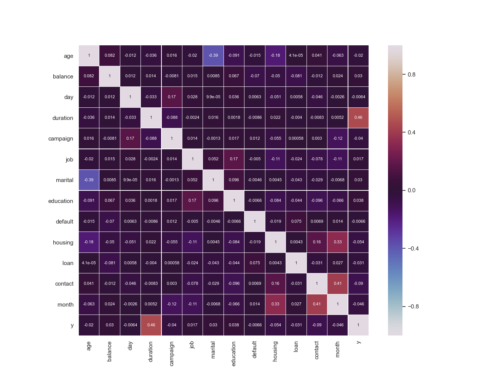

# Predicting subscription to time deposit using Artificial Neural Network
## Goal
###
CaseGoal.py output is:
  ```
Number of positive samples in training data for 1. loop: 2332 (7.29% of total)
Number of positive samples in training data for 2. loop: 2307 (7.21% of total)
Number of positive samples in training data for 3. loop: 2331 (7.28% of total)
Number of positive samples in training data for 4. loop: 2344 (7.33% of total)
Number of positive samples in training data for 5. loop: 2281 (7.13% of total)
The average score according to the 5-fold cross-validation method is: 84.30%
and the standard deviation is:  0.004668380428023137
  ```
Could be very little difference for every other running times in output. 
###
## Bonuses
###
WeightAnalysis.py give us 5 plots about discrete features value weight. We can infer about each discerete feature's values by examining these plots.


###
###
FeatureSelection.py give us a correlation matrix and three data frames about data features relation with target column. 
These calculations are as follows:
- with correlation method

- with entropy estimation
  ```
  age        0.004800
  balance    0.074362
  day        0.004773
  duration   0.100265
  campaign   0.001566
  job        0.001720
  marital    0.001650
  education  0.001178
  default    0.000023
  housing    0.001449
  loan       0.000514
  contact    0.004449
  month      0.011453
  ```
- with f-test
  - f values:
    ```
    age           16.502785
    balance       36.590092
    day            1.649003
    duration   10803.799805
    campaign      65.231995
    job           11.906427
    marital       36.589787
    education     56.587845
    default        1.721092
    housing      118.442001
    loan          38.547974
    contact      323.897888
    month         85.335800
    ```
  - p values:
    ```
    age        4.867125e-05
    balance    1.470615e-09
    day        1.991022e-01
    duration   0.000000e+00
    campaign   6.842766e-16
    job        5.599830e-04
    marital    1.470845e-09
    education  5.486695e-14
    default    1.895601e-01
    housing    1.516651e-27
    loan       5.394808e-10
    contact    0.000000e+00
    month      2.637499e-20
    ```
###
 
 
 
 
 
 
 
 
 
 
 
 
 
 
 
 
 
 
 
 
 
 
 
 
 
 
 
 
